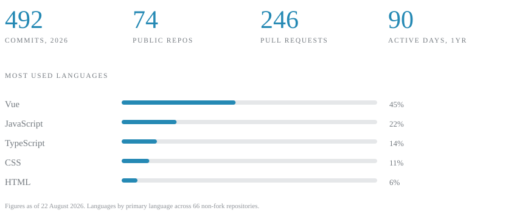

# AI Web Developer

## ABOUT

Mostly in the Vue and React halves of the world, currently spending an unreasonable amount of time on interfaces that think back.

I like the boring parts: render budgets, cache keys, the state machine nobody wanted to draw. Then I like the fun part, which is making a streaming response feel like a conversation instead of a loading bar. Full stack when the backend is in the way — Node, Express, Mongo, ship it.

## STACK

### FRONTEND

         

### BACKEND &amp; DATA

   

### SHIP &amp; TOOLING

     

## LANGUAGES

   

## CONTACT

 [@JimeblueMiguez](https://twitter.com/JimeblueMiguez)
