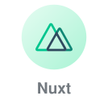
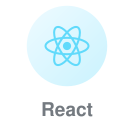
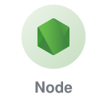
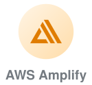
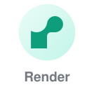

# AI Web Developer
 

Mostly in the Vue and React halves of the world, currently spending an unreasonable amount of time on interfaces that think back.

I like the boring parts: render budgets, cache keys, the state machine nobody wanted to draw. Then I like the fun part, which is making a streaming response feel like a conversation instead of a loading bar. Full stack when the backend is in the way — Node, Express, Mongo, ship it.

## Stack

### Frontend

         
### Backend &amp; Data

   
### Ship &amp; Tooling

     
 

###  Human Languages

 

###  Let's Connect

[][twitter]

 

 
 

[website]: https://extension.ucsd.edu/courses-and-programs/front-end-development
[theCollabLab]: https://the-collab-lab.codes/developers/
[smartShoppingList]: https://tcl-44-smart-shopping-list.web.app/list
[Certificate]: https://extension.ucsd.edu/courses-and-programs/front-end-development
[twitter]: https://twitter.com/JimeblueMiguez
[instagram]: https://instagram.com/jimeblue
[webdevplaylist]: https://www.youtube.com/playlist?list=PLkwxH9e_vrAJ0WbEsFA9W3I1W-g_BTsbt
[jsplaylist]: https://www.youtube.com/playlist?list=PLkwxH9e_vrALRJKu7wfXby3MKeflhTu6B
[cssplaylist]: https://www.youtube.com/playlist?list=PLkwxH9e_vrALSdvZuEh6gqQdmDoDIoqz4
[reactplaylist]: https://www.youtube.com/playlist?list=PLkwxH9e_vrAK4TdffpxKY3QGyHCpxFcQ0
[figma]: https://www.figma.com/
[agile]: https://www.atlassian.com/agile
[clickup]: https://clickup.com/onboarding?fp_ref=48cb1&gclid=CjwKCAjwp_GJBhBmEiwALWBQk22X9qelmXPMAEOHt7w5xjHzcEqgXvre5eFVrUc1OSrORVXXzE8QMxoCDrkQAvD_BwE
[tailwind]: https://tailwindcss.com/
[jquery]: https://jquery.com/
[materialUI]: https://mui.com/
 

